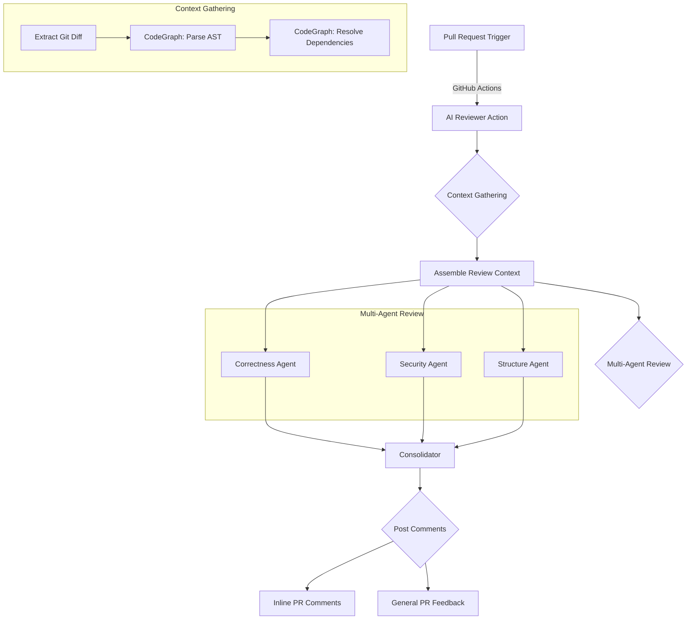

# 🧪 Layered AI Code Review System

An automated, hyper-critical code defect detection system. It leverages a Go backend, a multi-pass LLM orchestration strategy (Gemini), and a Next.js dashboard to provide deep, contextual feedback directly on GitHub Pull Requests.

## 🔄 Application Flow




---

## 🚀 Team Developer Quick-Start

Want AI code reviews on your repo? It takes less than a minute.

👉 **[Company Rollout Guide](./docs/COMPANY_ROLLOUT_GUIDE.md)** — *Follow this for private company-wide setup.*

1.  **[Install the GitHub App](https://github.com/settings/apps/sentinal-review/installations)** on your repository.
2.  **Add `GEMINI_API_KEY`** to your repository secrets (Settings > Secrets > Actions).
3.  Add a simple workflow file at `.github/workflows/ai-review.yml`:

```yaml
name: AI Code Review
on:
  pull_request:
    types: [opened, synchronize]

permissions:
  contents: read
  pull-requests: write

jobs:
  review:
    runs-on: ubuntu-latest
    steps:
      - name: Checkout Code
        uses: actions/checkout@v4
        with:
          fetch-depth: 0

      - name: Run AI Reviewer
        uses: tegveer-work/ai-code-reviewer@main 
        with:
          gemini_api_key: ${{ secrets.GEMINI_API_KEY }}
          github_token: ${{ secrets.GITHUB_TOKEN }}

```

👉 **[See the Full Developer Guide](./docs/DEVELOPER_GUIDE.md)**

---

## 🛠️ How it Works

1.  **CodeGraph Deterministic Context**: Instead of guessing context or passing the entire repo, the system parses the Abstract Syntax Tree (AST) of the changed files to extract precise dependencies (functions, types, methods), scanning the repository for their definitions.
2.  **Multi-Agent Ecosystem**: PR chunks are analyzed in parallel by three specialized "Senior Engineer" personas:
    - **Correctness**: Hunts for business logic flaws, nil pointers, concurrency issues.
    - **Security**: Acts as an attacker hunting for injection, missing auth, sensitive data leaks.
    - **Structure**: Audits for architectural decay, God classes, circular dependencies.
3.  **Consolidation**: A meta-agent deduplicates reports, sorts them by severity, and caps comments to avoid overwhelming the PR author.
4.  **Resilient Feedback**: If a comment applies to a line outside the GitHub diff context limit, the reviewer automatically posts it as a general PR comment to ensure the feedback is never lost.

---

## 🚀 Local Development Setup

### 1. GitHub App Setup
1.  Go to **GitHub Settings > Developer Settings > GitHub Apps > New GitHub App**.
2.  Set **Webhook URL** to your ngrok URL (e.g., `https://xyz.ngrok-free.app/webhook`).
3.  Set a **Webhook Secret** (any random string).
4.  **Permissions**:
    - `Pull Requests`: Read & Write
    - `Checks`: Read & Write
    - `Contents`: Read (for fetching files)
    - `Metadata`: Read
5.  **Events**: Subscribe to `Pull request`.
6.  Generate a **Private Key** (.pem) and save it as `backend/private-key.pem`.
7.  Note your **App ID**, **Client ID**, and **Client Secret**.

### 2. Backend Setup (Go)
1.  Navigate to `backend/`: `cd backend`
2.  Install dependencies: `go mod tidy`
3.  Create `.env` file:
    ```env
    # GitHub App Credentials
    GITHUB_APP_ID="123456"
    GITHUB_CLIENT_ID="your_client_id"
    GITHUB_CLIENT_SECRET="your_client_secret"
    GITHUB_PRIVATE_KEY_PATH="./private-key.pem"
    GITHUB_WEBHOOK_SECRET="your_shared_secret"

    # LLM API Key
    GEMINI_API_KEY="your_google_ai_studio_api_key"

    # Server Config
    PORT="8080"
    ```
4.  Run the server: `go run main.go`

### 3. Frontend Setup (Next.js)
1.  Navigate to `dashboard/`: `cd dashboard`
2.  Install dependencies: `npm install`
3.  Run development server: `npm run dev`
4.  Access at `http://localhost:3000`. Use the dashboard to enable/disable specific review layers (Security, Performance, etc.) for each repo.

### 4. Running Checks
1.  Expose your local port: `ngrok http 8080`
2.  Update the **Webhook URL** in your GitHub App settings to match the ngrok URL.
3.  Open a Pull Request on a repository where you've installed the app.
4.  Watch the backend logs and your PR "Checks" tab!

---

---

## 🤖 GitHub Actions Integration

You can run the AI Code Reviewer entirely within your repository using GitHub Actions. This is the **Security-First** mode where your code never leaves the GitHub runner except for LLM API calls.

### 🔑 1. Configure Secrets
Add the following secrets to your repository (**Settings > Secrets and variables > Actions**):

### 📦 2. Choose Your Setup

> [!IMPORTANT]
> The simple setup (Option B) ONLY works if your AI Reviewer repository is **Public**. If it is **Private**, you MUST use Option A.

#### Option A: Private Action (Recommended for Teams)

Use this if you want to keep the AI Reviewer code private.

Create `.github/workflows/ai-review.yml`:
```yaml
name: AI Code Review
on:
  pull_request:
    types: [opened, synchronize]

jobs:
  review:
    runs-on: ubuntu-latest
    permissions:
      contents: read
      pull-requests: write # Required to post comments
    steps:
      - name: Checkout Your Code
        uses: actions/checkout@v4
        with:
          fetch-depth: 0

      - name: Checkout AI Reviewer Action
        uses: actions/checkout@v4
        with:
          repository: tegveer-work/ai-code-reviewer # Update to your repo name
          token: ${{ secrets.ACTION_ACCESS_TOKEN }} 
          path: .github/actions/ai-reviewer
          ref: main

      - name: Run AI Reviewer
        uses: ./.github/actions/ai-reviewer
        with:
          gemini_api_key: ${{ secrets.GEMINI_API_KEY }}
          github_token: ${{ secrets.GITHUB_TOKEN }}
```

#### Option B: Public Action (Easiest)
If you make the AI Reviewer repository **Public**, anyone can use it with a single line:

```yaml
      - name: AI Code Reviewer
        uses: tegveer-work/ai-code-reviewer@main 
        with:
          gemini_api_key: ${{ secrets.GEMINI_API_KEY }}
          github_token: ${{ secrets.GITHUB_TOKEN }}
```

---

- [Company Rollout Guide](./docs/COMPANY_ROLLOUT_GUIDE.md) - **Start Here for Company Setup**
- [Team Usage Guide](./docs/TEAM_USAGE.md)
- [Project Overview](./docs/PROJECT_OVERVIEW.md)
- [Architectural Decision Records](./docs/ARCHITECTURAL_DECISION_RECORDS.md)
- [**Troubleshooting Guide**](./docs/DEVELOPER_GUIDE.md#troubleshooting)


