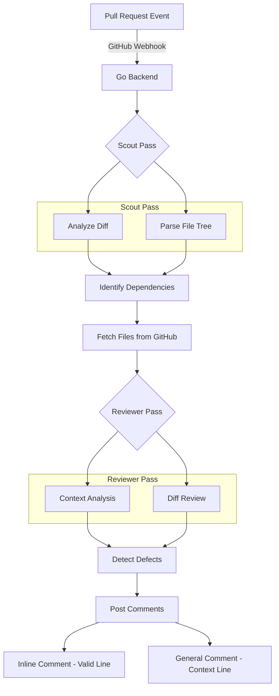

# 🧪 Layered AI Code Review System

An automated, hyper-critical code defect detection system. It leverages a Go backend, a multi-pass LLM orchestration strategy (Gemini), and a Next.js dashboard to provide deep, contextual feedback directly on GitHub Pull Requests.

## 🔄 Application Flow




---

## 🛠️ How it Works

1.  **Intent Discovery**: The system reads your PR title, description, and last 10 commits to understand *what* you are trying to build.
2.  **Breadcrumb Strategy (Scout)**: An LLM analyzes the file structure and the changed code to find "missing pieces" (e.g., if you changed a model call, it asks to read the model definition).
3.  **Audit Mode**: The Reviewer LLM is placed in a "Security & Reliability Audit" mode. It is forbidden from praising your code and focuses entirely on finding bugs, security flaws, and performance leaks using the **Full File Context**.
4.  **Resilient Feedback**: If the AI finds a bug in a related file (not the one you edited), it will still tell you via a general PR comment.

---

## 🚀 GitHub Actions Setup (Team Guide)

Since this repository is private, teammates added as collaborators can use this AI Reviewer directly in their own projects.

### 1. Add Secrets
Go to your project repository's **Settings > Secrets and variables > Actions** and add:
- `GEMINI_API_KEY`: Your Google Gemini API Key.
- `GITHUB_TOKEN`: This is usually built-in, no action needed unless you use a custom PAT.

### 2. Copy & Paste Workflow
Create `.github/workflows/ai-review.yml` in your project and paste the following:

```yaml
name: AI Code Review

on:
  pull_request:
    types: [opened, synchronize]

permissions:
  contents: read
  pull-requests: write

jobs:
  review:
    runs-on: ubuntu-latest
    steps:
      - name: Checkout Code
        uses: actions/checkout@v4
        with:
          fetch-depth: 0 # Important for diff analysis

      - name: AI Code Reviewer
        uses: tegveer-work/ai-code-reviewer@main 
        with:
          gemini_api_key: ${{ secrets.GEMINI_API_KEY }}
          github_token: ${{ secrets.GITHUB_TOKEN }}
          allowed_domain: "appointy.com" 
```

---

## 💻 Local Development Setup

### 1. GitHub App Setup
1.  Go to **GitHub Settings > Developer Settings > GitHub Apps > New GitHub App**.
2.  Set **Webhook URL** to your ngrok URL (e.g., `https://xyz.ngrok-free.app/webhook`).
3.  Set a **Webhook Secret** (any random string).
4.  **Permissions**:
    - `Pull Requests`: Read & Write
    - `Checks`: Read & Write
    - `Contents`: Read (for fetching files)
    - `Metadata`: Read
5.  **Events**: Subscribe to `Pull request`.
6.  Generate a **Private Key** (.pem) and save it as `backend/private-key.pem`.
7.  Note your **App ID**, **Client ID**, and **Client Secret**.

### 2. Backend Setup (Go)
1.  Navigate to `backend/`: `cd backend`
2.  Install dependencies: `go mod tidy`
3.  Create `.env` file:
    ```env
    # GitHub App Credentials
    GITHUB_APP_ID="123456"
    GITHUB_CLIENT_ID="your_client_id"
    GITHUB_CLIENT_SECRET="your_client_secret"
    GITHUB_PRIVATE_KEY_PATH="./private-key.pem"
    GITHUB_WEBHOOK_SECRET="your_shared_secret"

    # LLM API Key
    GEMINI_API_KEY="your_google_ai_studio_api_key"

    # Server Config
    PORT="8080"
    ```
4.  Run the server: `go run main.go`

### 3. Frontend Setup (Next.js)
1.  Navigate to `dashboard/`: `cd dashboard`
2.  Install dependencies: `npm install`
3.  Run development server: `npm run dev`
4.  Access at `http://localhost:3000`. Use the dashboard to enable/disable specific review layers (Security, Performance, etc.) for each repo.

### 4. Running Checks
1.  Expose your local port: `ngrok http 8080`
2.  Update the **Webhook URL** in your GitHub App settings to match the ngrok URL.
3.  Open a Pull Request on a repository where you've installed the app.
4.  Watch the backend logs and your PR "Checks" tab!

---

## 🛡️ Key Documentation
- [Project Overview](./docs/PROJECT_OVERVIEW.md)
- [Architectural Decision Records](./docs/ARCHITECTURAL_DECISION_RECORDS.md)
- [Context Window Management](./docs/CONTEXT_WINDOW_MANAGEMENT.md)
- [Cost Analysis](./docs/COST_ANALYSIS.md)
- [Advanced Context Strategy](./docs/advanced_context_strategy.md)

