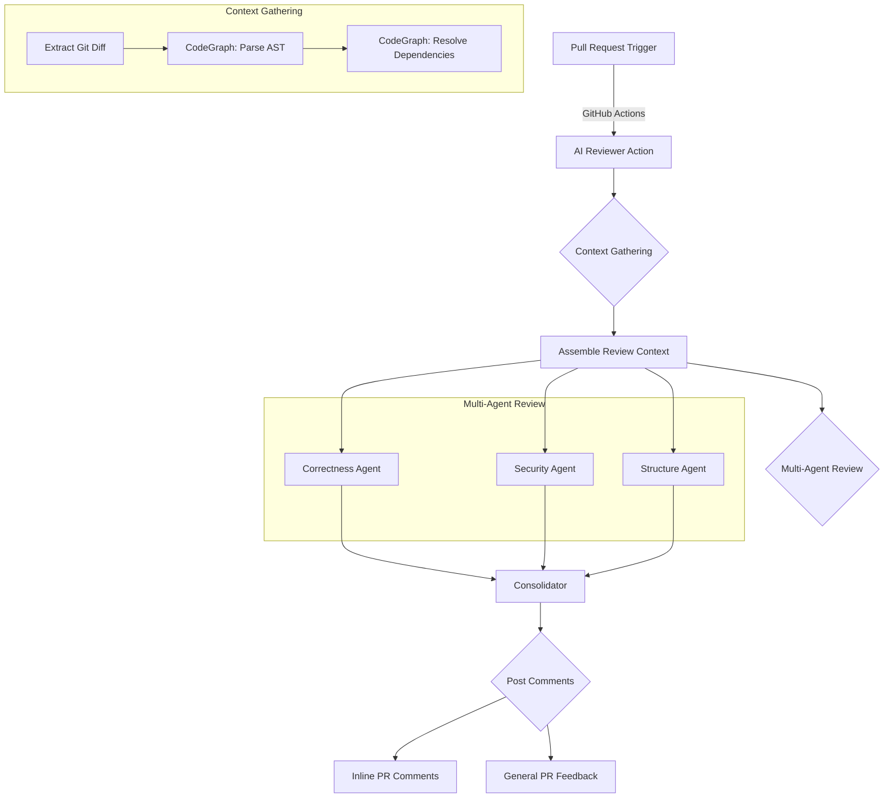

# 🧪 Layered AI Code Review System

An automated, hyper-critical code defect detection system running entirely within **GitHub Actions**. It leverages a multi-pass LLM orchestration strategy (Gemini 2.5 Pro) to provide deep, contextual feedback directly on your Pull Requests.

## 🔄 Application Flow



---

## 🚀 Quick Start (GitHub Actions)

Add AI code reviews to any repository in less than a minute. No server or GitHub App installation required.

1.  **Add `GEMINI_API_KEY`** to your repository or organization secrets (Settings > Secrets > Actions).
2.  Create a workflow file at `.github/workflows/ai-review.yml`:

```yaml
name: AI Code Review

on:
  pull_request:
    types: [opened, synchronize]

permissions:
  contents: read
  pull-requests: write
  checks: write

jobs:
  review:
    runs-on: ubuntu-latest
    steps:
      - name: Checkout Code
        uses: actions/checkout@v4
        with:
          fetch-depth: 0

      - name: Run AI Reviewer
        uses: appointytech/ai-code-reviewer@main # (OR use your org/repo path here)
        with:
          # Specify your provider: 'gemini' (default), 'openai', or 'claude'
          llm_provider: gemini
          gemini_api_key: ${{ secrets.GEMINI_API_KEY }}
          github_token: ${{ secrets.GITHUB_TOKEN }}
          # Optional: Custom rules for your repo
          review_rules: |
            instructions:
              - "Use CHI router for HTTP handlers"
              - "Ignore debug logs or print statements"
            ignore:
              - "**/*_test.go"
            focus:
              - "Authentication logic"
```

---

## 🔑 API Key Configuration

The system is designed to be LLM-agnostic and supports Gemini, OpenAI, and Anthropic Claude. You must configure the `llm_provider` input in your workflow along with the corresponding API key.

### Supported Providers:
- **gemini** (Default): Requires `gemini_api_key`
- **openai**: Requires `openai_api_key`
- **claude**: Requires `anthropic_api_key`

The system resolves API keys using the following priority:

1.  **Explicit Input**: Passed via the `with: [provider]_api_key` parameter in your YAML (can be a user's personal secret).
2.  **Organization/Repository Secret**: A secret named appropriately (`GEMINI_API_KEY`, `OPENAI_API_KEY`, `ANTHROPIC_API_KEY`) defined at the org or repo level.
3.  **Environment Variable**: Mapped directly in the runner environment.

> [!TIP]
> This allows individual developers to use their own keys for specific repos while the rest of the organization uses a shared billing key.

---

## 🛠️ How it Works

1.  **CodeGraph Deterministic Context**: Instead of guessing context or passing the entire repo, the system parses the Abstract Syntax Tree (AST) of the changed files to extract precise dependencies (functions, types, methods), scanning the repository for their definitions.
2.  **Multi-Agent Ecosystem**: PR chunks are analyzed in parallel by three specialized "Senior Engineer" personas:
    - **Correctness**: Hunts for business logic flaws, nil pointers, and concurrency issues.
    - **Security**: Acts as an attacker hunting for injection, missing auth, and sensitive data leaks.
    - **Structure**: Audits for architectural decay, inconsistent patterns, and breaking contract changes.
3.  **Intelligent Consolidation**: A final LLM pass deduplicates reports from all three agents, merges overlapping findings, and sorts them by severity.
4.  **Resilient Feedback**: If a comment applies to a line outside the GitHub diff context limit, the reviewer automatically posts it as a general PR comment to ensure the feedback is never lost.

---

## � Project Structure

```
backend/
├── cmd/
│   └── cli/             # Entry point for the GitHub Action
├── internal/
│   ├── agents/          # Specialist persona prompts & logic
│   ├── chunker/         # Large PR file grouping
│   ├── codegraph/       # AST parsing and dependency resolution
│   ├── github/          # GitHub API integration & comment posting
│   ├── llm/             # Gemini API client & result consolidation
│   └── orchestrator/    # Pipeline coordination (Parallel fan-out)
```

---

## 📚 Documentation
- [Cost Analysis](./docs/COST_ANALYSIS.md) - *Detailed token & pricing breakdown*
- [Team Usage Guide](./docs/TEAM_USAGE.md)
- [Project Overview](./docs/PROJECT_OVERVIEW.md)
- [**Custom Review Rules**](./docs/DEVELOPER_RULES.md) - *Guide to personalizing the AI for your codebase*
- [Architectural Decision Records](./docs/ARCHITECTURAL_DECISION_RECORDS.md)
- [**Troubleshooting Guide**](./docs/DEVELOPER_GUIDE.md#troubleshooting)


