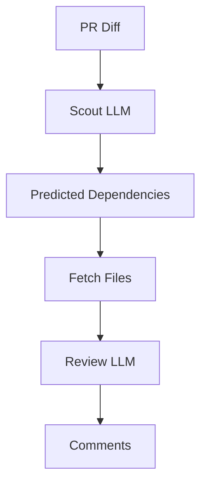
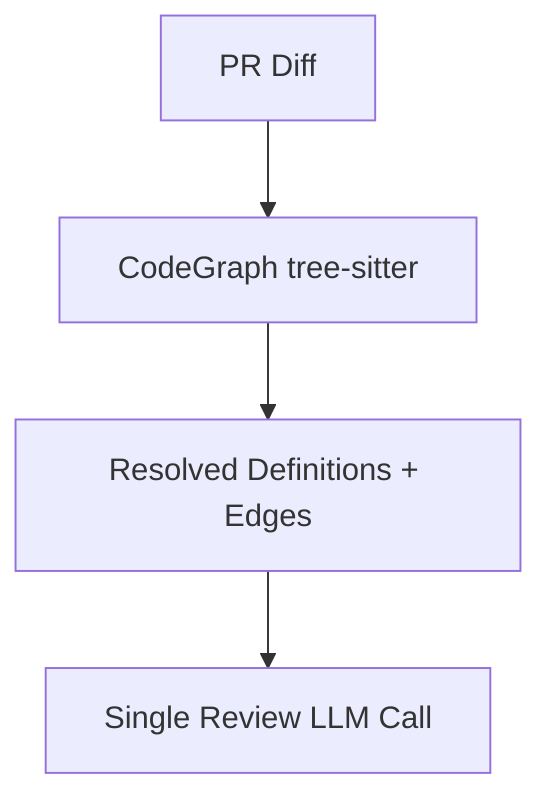
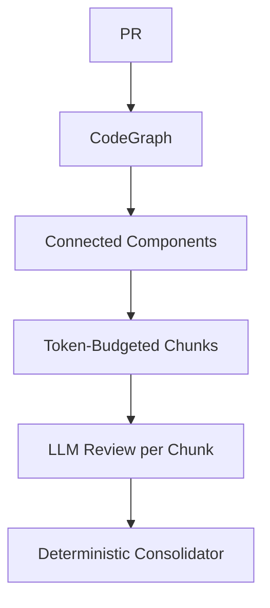
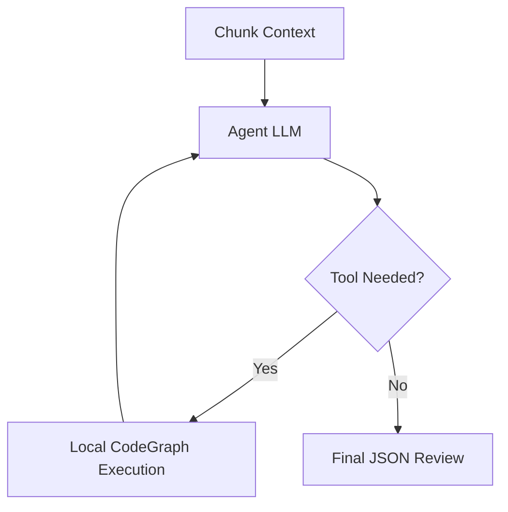

# Architectural Decision Records (ADR)

This document tracks the major architectural pivots and decisions made during the development of the AI Code Reviewer.

---

## ADR 1: Migration from n8n to Custom Go Backend

### Context
The first version of the AI Code Reviewer was implemented using n8n, a low-code workflow orchestration tool. GitHub webhooks triggered n8n flows, which then:
1. Pulled PR diffs.
2. Called Gemini.
3. Posted comments back to GitHub.

As review logic grew more complex (dependency tracing, context enrichment, retry logic), the workflow-based system became fragile.

### Decision
Rewrite the system as a standalone Go backend service.

### Rationale
- **Reliability**: Deterministic retry logic and error handling.
- **Performance**: Direct GitHub + Gemini API integration.
- **Version Control**: Go code is testable and diffable.
- **Scalability**: Needed custom orchestration for the future agentic design.
- **Security**: Full control over what leaves the GitHub runner.

*This marked the shift from workflow automation → engineered backend system.*

---

## ADR 2: Two-Pass LLM Architecture (Scout → Review)

### Context
Early single-pass LLM reviews failed in cross-file reasoning:
- The model only saw the diff.
- It guessed about types and functions defined elsewhere.
- It hallucinated dependencies and missed cross-boundary bugs.

To solve this, we introduced a two-pass LLM system.

### Decision
Implement a:
1. **Scout Pass (LLM #1)**: Analyze the diff and predict/suggest related files/types/functions to include.
2. **Review Pass (LLM #2)**: Receive diff + Scout-selected dependencies and perform final defect analysis.

### Architecture

### Benefits
- Improved cross-file context.
- Reduced blind diff review.

### Problems
- **Non-deterministic**: Scout could hallucinate wrong files.
- **Slow/Expensive**: Two LLM calls per PR doubled latency and token cost.
- **Unreliable**: Sometimes Scout missed critical dependencies.

---

## ADR 3: Deterministic Code Graph (Replacing LLM Scout)

### Context
The Scout LLM was fundamentally probabilistic. We needed deterministic dependency resolution. We observed that the Scout was trying to infer symbol relationships that could be computed locally.

### Decision
Remove the LLM Scout completely and implement a **CodeGraph engine using tree-sitter**.

### What the CodeGraph Does
- Parses AST of changed files.
- Extracts function calls, type references, struct usage, and imports.
- Resolves definitions across the repository.
- Generates a deterministic context graph.

### New Flow

### Why This Was Critical
- **No hallucinations**: symbol-accurate resolution.
- **Performance**: Milliseconds instead of seconds.
- **Stability**: Guaranteed real code context.

*This was the biggest architectural pivot: eliminating the probabilistic Scout phase entirely.*

---

## ADR 4: Single-Pass Deterministic Review

### Context
After removing Scout, we simplified: build deterministic graph context and send everything in a single LLM call.

### Decision
Use a single prompt containing:
- Diff hunks and full changed files.
- CodeGraph snippets and repo structure.
- Last 10 commits for intent analysis.

### Rationale
- Simpler orchestration.
- Lower cost than Scout + Review.
- Better context than diff-only review.

### Limitation Discovered
As PR size increased, context window overflow occurred. Truncation caused missing dependencies, and large PRs degraded accuracy.

---

## ADR 5: Token-Aware Graph-Based Chunking

### Context
Large PRs (50+ files) exceeded token budgets. Brute truncation dropped dependencies, while directory-based chunking split related files and missed cross-boundary bugs.

### Decision
Implement **Graph-Aware Chunking**.

### Strategy
1. Build CodeGraph.
2. Construct connected components (group files by dependency relationships).
3. Pack into ~200K token chunks.
4. Review each chunk independently and consolidate results.

### Flow

### Rationale
- Preserves dependency integrity.
- Avoids token overflow and scales to monorepos.
- No accuracy regression for small PRs.

---

## ADR 6: Production Plan — Multi-Agent Architecture

### Context
Even with chunking, a single monolithic prompt trying to detect bugs, security issues, and architecture violations produced mediocre precision. One prompt trying to be everything = diluted focus.

### Decision
Adopt **Parallel Specialist Agents**.

| Agent | Focus |
| :--- | :--- |
| **Correctness Agent** | Bugs + Performance |
| **Security Agent** | OWASP + Secrets |
| **Structure Agent** | Architecture + Lint |

All agents receive chunk-specific context, use CodeGraph, and support tool calls. Results are merged by an intelligent Consolidator.

---

## ADR 7: Agentic Tool-Call Loop

### Context
Preloading everything wastes tokens. The LLM should act as a reasoning engine, requesting context only when needed.

### Decision
Introduce function-calling tools:
- `get_symbol_definition` / `get_type_definition`
- `get_callers`
- `get_file_content`
- `search_codebase`

### New Flow

### Rationale
- **Surgical Context**: Tokens are used for reasoning, not dumping text.
- **Deep Tracing**: Accuracy improves on deep call chains.
