# Core Architectural Flow Diagram

This document details the exact execution flow of the AI Code Reviewer from the moment a Pull Request is opened to the final comment being posted. It specifically highlights the multi-tier context gathering strategy (Proactive vs. Reactive).

---

## High-Level Execution Flow

```mermaid
sequenceDiagram
    autonumber
    
    participant GH as GitHub Actions
    participant CLI as CLI Entrypoint
    participant API as GitHub API
    participant CG as CodeGraph Engine
    participant LLM as Orchestrator / Gemini API
    
    GH->>CLI: Trigger on PR (opened/synchronize)
    
    %% Setup & Fetch
    rect rgb(20, 40, 60)
    Note over CLI, API: 1. Setup & Metadata Fetch
    CLI->>API: Initialize GitHub Client Auth
    CLI->>API: Fetch PR Diff Content
    CLI->>API: Fetch Repository Structure (Tree)
    CLI->>API: Fetch Recent Commit History
    end
    
    %% Proactive Context
    rect rgb(0, 50, 20)
    Note over CLI, CG: 2. Proactive "Just-in-Time" Context Gathering
    CLI->>CG: Pass Changed Files (Diff)
    CG->>CG: Parse AST of Changed Files (tree-sitter)
    CG->>CG: Extract ALL referenced symbols (funcs, types, classes)
    CG->>CG: git grep to find WHERE symbols are defined in repo
    CG->>CG: Extract EXACT definition snippets (avoiding full files)
    CG-->>CLI: Return Context Summary (Capped to 12K chars)
    end
    
    %% Agentic Review
    rect rgb(60, 20, 60)
    Note over CLI, LLM: 3. Parallel Agentic Review Loop
    CLI->>LLM: Spawn 3 Specialist Agents (Goroutines)
    Note right of LLM: 1. Correctness Agent<br>2. Security Agent<br>3. Structure Agent
    
    loop Reactive Context Gathering
        LLM->>LLM: Analyze Diff + Proactive Context
        opt Needs More Context?
            LLM->>CG: Emit Tool Call (e.g., get_symbol_definition, get_callers)
            CG-->>LLM: Execute locally & return result
        end
    end
    LLM-->>CLI: Return 3 Independent Review Results
    end
    
    %% Consolidation
    rect rgb(60, 40, 20)
    Note over CLI, LLM: 4. Consolidation (Flash Model)
    CLI->>LLM: Send all 3 Agent Results to Consolidator
    LLM-->>CLI: Return Deduplicated, Ranked Final Review
    end
    
    %% Post
    rect rgb(20, 60, 60)
    Note over CLI, API: 5. Post Feedback
    CLI->>API: Publish Inline PR Comments
    CLI->>API: Publish General PR Summary Comment
    end
```

---

## Detailed Technical Breakdown

### 1. Initialization (`cmd/cli`)
When the GitHub Action runs, it executes the Go binary built from `cmd/cli/main.go`. It reads the standard `GITHUB_TOKEN` and `GEMINI_API_KEY` from the environment and initializes the internal GitHub client wrapper.

### 2. Proactive Context Gathering (`internal/codegraph`)
Instead of dumping the entire repository or just the raw diff into the prompt, the `Service.GetContext` layer acts as a filter:
- **Reference Extraction**: It uses tree-sitter to find every symbol referenced in the diff `(e.g., db.GetUser(id))`.
- **Definition Hunting**: It uses `git grep -l -F -w` to locate the files defining those symbols.
- **Snippet Slicing**: It parses those definition files to extract only the relevant `func GetUser` block, throwing away the rest of the file.
- **Budgeting**: It caps the total aggregated context at **12,000 characters** to leave room for the LLM to reason.

### 3. Orchestration & Chunking (`internal/orchestrator`)
Large PRs (exceeding token budgets) are split into logical chunks using **Graph-Aware Chunking**. Files that depend heavily on each other are grouped together. For each chunk, the Orchestrator spins up three parallel Go routines for the Specialist Agents:
1. **Correctness Agent**: Looks for bugs and edge cases.
2. **Security Agent**: Looks for vulnerabilities.
3. **Structure Agent**: Looks for architectural flaws.

### 4. Reactive Agentic Loop (`internal/llm/agent_loop.go`)
This is where the agent becomes active rather than passive. The loop (`RunAgentReview`):
- Sends the diff + proactive context to `gemini-2.5-pro`.
- The model outputs a `thought` and optionally requests a **Function Call** (Tool).
- If a tool is requested (`get_symbol_definition`, `get_file_content`, `get_callers`, `search_codebase`), the `ToolExecutor` runs the command locally using the CodeGraph or filesystem.
- The output is appended to the message history, and the model is queried again.
- This loop continues until the model outputs a final JSON review response.

### 5. Consolidation (`internal/llm/consolidator.go`)
The three agents operate blindly to each other, so they might flag the same issue (e.g., a missing nil check that also causes a security flaw). The Orchestrator passes all raw results to a **Consolidator Agent** running on the faster, cheaper `gemini-2.5-flash` model. It deduplicates, merges, and ranks the comments by severity.

### 6. GitHub Posting (`internal/github`)
The action maps the final JSON result back to GitHub's API format. If a comment targets a line outside the git diff context window (a common issue with GitHub's API), the system gracefully downgrades it to a general PR comment to ensure the feedback is never lost.
