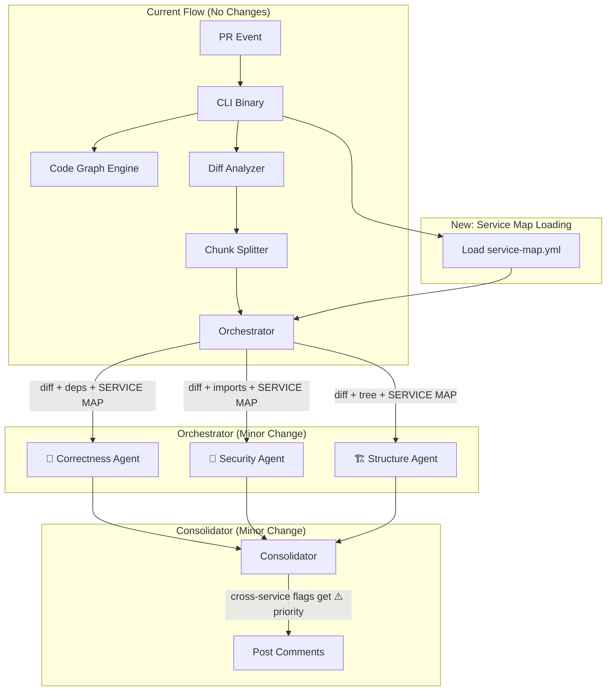

# Multi-Repo Cross-Dependency Reviews

> **Updated**: 2026-03-02  
> **Status**: Implementation plan finalized — Option 4 (LLM Service Map) first, then Option 1 (Contract Diff) as Phase 2.

---

## The Problem

In a microservices architecture, services communicate over well-defined boundaries (REST APIs, gRPC, message queues, shared libraries). When a developer changes a function signature, an API endpoint response shape, or a protobuf message in **Service A**, the system must detect that this change **breaks consumers in Service B, C, or D** — even though those repos are not part of the current PR.

**Today, our system does NOT do this.** The entire pipeline — CodeGraph, Scanner, ToolExecutor, and all agent prompts — is scoped to a single `RepoPath`. There is zero awareness of any code outside the checked-out repository.

---

## Current Architecture Audit

| Component | Scope | Cross-Repo Aware? |
| :--- | :--- | :---: |
| `Scanner.FindCandidates()` | `git grep` within one `RepoPath` | ❌ |
| `Graph.FindDefinition()` | Symbols indexed from local `.go`/`.ts`/`.py` files only | ❌ |
| `ToolExecutor.getCallers()` | Iterates `te.Graph.Files` (local graph only) | ❌ |
| `ToolExecutor.searchCodebase()` | `git grep` within one `RepoPath` | ❌ |
| Agent Prompts | No mention of "other services" or "consumers" | ❌ |

**Verdict: The system is 100% single-repository.**

---

## What Needs to Be Detected

| Change Type | Example | Impact |
| :--- | :--- | :--- |
| **API Response Shape Change** | Removing a field from a REST response JSON | Consumers parsing that field will crash |
| **Endpoint Deletion/Rename** | `DELETE /api/v1/users/{id}` removed | Callers get 404 |
| **gRPC/Protobuf Breaking Change** | Renaming a field or changing a field number | Deserialization failure in consumers |
| **Shared Library Signature Change** | Changing a function signature in a shared Go module | Import consumers won't compile |
| **Event Schema Change** | Changing the shape of a Kafka/RabbitMQ message | Consumer event handlers crash |
| **Database Schema Change** | Dropping a column read by another service | Runtime query failures |

---

## Options Analysis

### Option 1: API Contract Registry (OpenAPI / Protobuf Diff)

Each service maintains a machine-readable API contract (OpenAPI spec, `.proto` files, or GraphQL schema). On every PR, the system diffs the contract against the **last stable version** and flags breaking changes.

**Pros**: Deterministic, fast, industry-standard, language agnostic.  
**Cons**: Requires contract discipline, doesn't catch logic changes, setup overhead.  
**Effort**: Medium (2-3 weeks)

---

### Option 2: Cross-Repo Graph Stitching (Federated CodeGraph)

Each service publishes its CodeGraph as a cached artifact. When reviewing Service A, the system loads consumer graphs and checks cross-references.

**Pros**: Leverages existing CodeGraph, symbol-level precision.  
**Cons**: Shared state problem, staleness, doesn't understand HTTP/gRPC boundaries.  
**Effort**: High (4-6 weeks)

---

### Option 3: Consumer-Driven Contract Testing (Pact)

Consumers define contracts against providers, verified automatically on every PR.

**Pros**: Gold standard, catches runtime bugs.  
**Cons**: Very heavy adoption, needs Pact Broker, not AI-driven.  
**Effort**: Very High (6-8 weeks + ongoing team adoption)

---

### Option 4: LLM-Powered Service Map Inference (AI-Only)

Inject a lightweight `service-map.yml` into the agent's system prompt. The LLM reasons about cross-service impact.

**Pros**: Lowest effort, catches logic changes, no infrastructure.  
**Cons**: Probabilistic, manual YAML maintenance, no verification.  
**Effort**: Low (3-5 days)

---

## Comparison Matrix

| Criteria | Option 1 | Option 2 | Option 3 | Option 4 |
| :--- | :---: | :---: | :---: | :---: |
| **Accuracy** | ⭐⭐⭐⭐⭐ | ⭐⭐⭐⭐ | ⭐⭐⭐⭐⭐ | ⭐⭐⭐ |
| **Engineering Effort** | Medium | High | Very High | Low |
| **Team Adoption Effort** | Medium | Low | Very High | Very Low |
| **Catches Logic Bugs** | ❌ | ❌ | ✅ | ✅ |
| **Catches Schema Breaks** | ✅ | ✅ | ✅ | ⚠️ |
| **Infrastructure Required** | Registry repo | Shared store | Pact Broker | None |
| **Works Without Specs** | ❌ | ✅ | ❌ | ✅ |
| **Fits Our Architecture** | ✅ | ✅ | ❌ | ✅✅ |

---

## ✅ Chosen Plan: Option 4 First, Then Option 1

**Why this combination fits our architecture best:**

1. **We already have 3 parallel specialist agents** (Correctness, Security, Structure) with differentiated context. Adding a service map is just adding one more context section to each agent's prompt — no architectural changes needed.
2. **We already have tool calling** (`get_symbol_definition`, `get_file_content`, `get_callers`, `search_codebase`). We can add a `get_service_contract` tool later (Phase 2) to fetch OpenAPI specs from a registry.
3. **Zero infrastructure** for Phase 1 — just a YAML file in the repo and prompt augmentation. Matches our "code stays on the runner" constraint perfectly.
4. **Pact (Option 3)** is a testing framework, not a review system — doesn't integrate with our agents at all.
5. **Graph Stitching (Option 2)** requires shared artifact storage and solving staleness — too much infra for the initial version.

---

## Implementation Plan: Phase 1 — Service Map (3-5 Days)

### Service Map Format

Teams place a `.ai-reviewer/service-map.yml` in their repo:

```yaml
# .ai-reviewer/service-map.yml
version: 1
service_name: user-service

# What this service exposes
exposes:
  rest:
    - method: GET
      path: /api/v1/users/{id}
      response_fields: [id, name, email, role, created_at]
    - method: POST
      path: /api/v1/users
      request_fields: [name, email, password]
      response_fields: [id, name, email]
    - method: DELETE
      path: /api/v1/users/{id}

  grpc:
    - service: UserService
      methods: [GetUser, CreateUser, DeleteUser]
      proto_file: proto/user.proto

  events:
    - topic: user.created
      schema_fields: [user_id, email, name, timestamp]
    - topic: user.deleted
      schema_fields: [user_id, timestamp]

# Who consumes this service
consumed_by:
  - service: billing-service
    uses:
      - GET /api/v1/users/{id}
      - event: user.created
  - service: notification-service
    uses:
      - GET /api/v1/users/{id}
      - event: user.created
      - event: user.deleted
  - service: analytics-service
    uses:
      - GET /api/v1/users/{id}

# What this service consumes from others
consumes:
  - service: auth-service
    uses:
      - POST /api/v1/auth/validate-token
  - service: email-service
    uses:
      - POST /api/v1/emails/send
```

### How It Integrates With Current Architecture



### Code Changes Required

| File | Change | Effort |
| :--- | :--- | :---: |
| `internal/models/models.go` | Add `ServiceMap` struct (parsed YAML) | Small |
| `internal/servicemap/loader.go` | **[NEW]** Parse `.ai-reviewer/service-map.yml` | Small |
| `internal/agents/types.go` | Add `ServiceMap *ServiceMap` field to `AgentConfig` | Tiny |
| `internal/agents/prompts.go` | Add `buildServiceMapContext()` — injects service map into each agent's system prompt | Medium |
| `internal/orchestrator/orchestrator.go` | Pass `ServiceMap` into all 3 agent configs | Tiny |
| `cmd/cli/main.go` | Load service map file before review | Small |

#### Prompt Augmentation Example

Added to each agent's system prompt when `service-map.yml` exists:

```
## CROSS-SERVICE DEPENDENCY CONTEXT

This service ("user-service") is consumed by other microservices.
Any changes to exposed APIs or events may break downstream consumers.

### Exposed Endpoints:
- GET /api/v1/users/{id} → response: [id, name, email, role, created_at]
- POST /api/v1/users → request: [name, email, password], response: [id, name, email]
- DELETE /api/v1/users/{id}

### Known Consumers:
- billing-service: uses GET /api/v1/users/{id}, listens to user.created
- notification-service: uses GET /api/v1/users/{id}, listens to user.created and user.deleted

### Published Events:
- user.created: [user_id, email, name, timestamp]
- user.deleted: [user_id, timestamp]

⚠️ INSTRUCTIONS FOR CROSS-SERVICE REVIEW:
1. If this PR modifies ANY exposed endpoint's response shape, REQUEST body, or URL path → FLAG IT as a potential breaking change for listed consumers.
2. If this PR changes the fields in a published event → FLAG IT with the affected consumers.
3. If this PR removes or renames an endpoint → FLAG IT as CRITICAL.
4. For each cross-service flag, name the specific consumer(s) that would be affected.
5. Use severity "critical" for breaking changes, "warning" for potentially breaking changes.
```

### Agent Behavior With Service Map

| What the LLM Sees in the Diff | What It Flags |
| :--- | :--- |
| `response.Email` renamed to `response.EmailAddr` | ⚠️ CRITICAL: `billing-service` and `notification-service` consume `GET /users/{id}` and expect field `email`. Renaming to `emailAddr` will break their JSON parsing. |
| `DELETE /api/v1/users/{id}` endpoint removed | ⚠️ CRITICAL: This endpoint has no listed consumers, but verify no unlisted services depend on it. |
| New field `phone` added to `user.created` event | ✅ PASS: Adding a field is backward-compatible. Consumers ignore unknown fields. |
| `user.deleted` event payload changes `user_id` to `id` | ⚠️ CRITICAL: `notification-service` listens to `user.deleted` and expects field `user_id`. |

---

## Implementation Plan: Phase 2 — Contract Diffing (2-3 Weeks)

For teams that maintain OpenAPI or Protobuf specs, add **deterministic** contract diffing alongside the LLM-based inference.

### New Agent Tool: `check_contract_breaking`

Add a new tool to the agent's toolkit:

```go
{
    "name": "check_contract_breaking",
    "description": "Check if changes to an OpenAPI spec or .proto file introduce breaking changes against the last stable version.",
    "parameters": {
        "type": "object",
        "properties": {
            "spec_path": {
                "type": "string",
                "description": "Path to the changed spec file (e.g. 'api/openapi.yaml' or 'proto/user.proto')"
            }
        },
        "required": ["spec_path"]
    }
}
```

### How It Works

1. Agent sees a changed `.yaml`/`.json` (OpenAPI) or `.proto` file in the diff.
2. Agent calls `check_contract_breaking(spec_path="api/openapi.yaml")`.
3. Tool executor:
   - Runs `oasdiff breaking` (for OpenAPI) or `buf breaking` (for proto) comparing HEAD vs base.
   - Returns the structured diff (removed endpoints, changed fields, etc.).
4. Agent uses this deterministic output alongside the service map to produce high-confidence cross-service flags.

### Code Changes Required

| File | Change |
| :--- | :--- |
| `internal/llm/tools.go` | Add `check_contract_breaking` tool declaration and executor |
| `internal/contractdiff/differ.go` | **[NEW]** Wrapper around `oasdiff` CLI / `buf` CLI |
| `action.yml` | Optionally install `oasdiff` / `buf` binaries |

---

## Implementation Plan: Phase 3 (Optional) — Cross-Repo Graph Stitching

Only pursue this for teams with shared Go modules or monorepo-adjacent setups. Each service CI publishes its `graph.json` to a shared location, and the reviewer loads consumer graphs for cross-reference checks.

**Deferred** — only worth doing if Phase 1 + 2 prove insufficient.

---

## Distribution Plan: Sharing the Private Repo

### The Problem

The AI Code Reviewer repo is **private** inside your org (`appointytech/ai-code-reviewer`). This means:
- ✅ Team members in the org can use `uses: appointytech/ai-code-reviewer@main` in any org repo.
- ❌ Someone **outside the org** (e.g., a teammate's personal repo, or a client) **cannot** access a private action via `uses:`.

### Options for External Private Access

#### Option A: GitHub Fine-Grained PAT + Checkout Pattern (Recommended)

The external user checks out the private repo via a Personal Access Token, then runs the action **locally** from that checkout.

**Setup for the external user:**

1. **Create a Fine-Grained PAT** scoped to read `appointytech/ai-code-reviewer`:
   - Go to GitHub → Settings → Developer Settings → Fine-grained tokens
   - Repository access: **Only select repositories** → `appointytech/ai-code-reviewer`
   - Permissions: **Contents: Read-only**
   - Generate → copy the token

2. **Add secrets** to the external repo:
   - `ACTION_ACCESS_TOKEN` = the PAT from step 1
   - `GEMINI_API_KEY` = their Gemini API key

3. **Create workflow** in external repo:

```yaml
name: AI Code Review

on:
  pull_request:
    types: [opened, synchronize]

permissions:
  contents: read
  pull-requests: write

jobs:
  review:
    runs-on: ubuntu-latest
    steps:
      - name: Checkout Code (Your Repo)
        uses: actions/checkout@v4
        with:
          fetch-depth: 0

      - name: Checkout AI Reviewer (Private Action)
        uses: actions/checkout@v4
        with:
          repository: appointytech/ai-code-reviewer
          token: ${{ secrets.ACTION_ACCESS_TOKEN }}
          path: .ai-reviewer-action

      - name: Run AI Reviewer
        uses: ./.ai-reviewer-action
        with:
          gemini_api_key: ${{ secrets.GEMINI_API_KEY }}
          github_token: ${{ secrets.GITHUB_TOKEN }}
```

**Pros**:
- ✅ Repo stays **fully private** — no exposure
- ✅ PAT is scoped to **read-only on one repo** — minimal blast radius
- ✅ Works for any external repo (personal, different org, client)
- ✅ Auto-gets latest `main` on every run

**Cons**:
- ❌ Requires one-time PAT setup per external user
- ❌ PATs have expiry (max 1 year) — must be rotated

---

#### Option B: GitHub App Installation (Best for Multiple External Users)

Create a **GitHub App** (not a PAT) that grants read access to the private action repo. Anyone who installs the app gets access.

1. Create a GitHub App under the org with `contents:read` permission
2. Install it on repos that need access
3. Use `actions/create-github-app-token` to generate a short-lived token at runtime

```yaml
      - name: Generate App Token
        id: app-token
        uses: actions/create-github-app-token@v1
        with:
          app-id: ${{ vars.REVIEWER_APP_ID }}
          private-key: ${{ secrets.REVIEWER_APP_PRIVATE_KEY }}
          owner: appointytech
          repositories: ai-code-reviewer

      - name: Checkout AI Reviewer
        uses: actions/checkout@v4
        with:
          repository: appointytech/ai-code-reviewer
          token: ${{ steps.app-token.outputs.token }}
          path: .ai-reviewer-action
```

**Pros**:
- ✅ No per-user PATs — one app, many installs
- ✅ Short-lived tokens (more secure)
- ✅ Better for 5+ external users

**Cons**:
- ❌ More initial setup (create/configure GitHub App)
- ❌ Each external repo must install the app

---

#### Option C: Published as a Private NPM/Go Package

Bundle the action as a self-contained binary published to a private package registry (GitHub Packages, npm, etc.).

**Not recommended** — adds significant CI complexity for minimal benefit over Option A.

---

### Recommendation

| # of External Users | Best Option |
| :---: | :--- |
| 1-3 | **Option A** (PAT + Checkout) — simplest, 5-minute setup |
| 4+ | **Option B** (GitHub App) — scales better, no PAT rotation |
| Public | Make the repo public (if acceptable) — `uses: appointytech/ai-code-reviewer@main` just works |

> [!TIP]
> For now, start with **Option A** for your teammate. If more people need access later, migrate to **Option B** (the workflow YAML stays almost identical — only the token-generation step changes).
