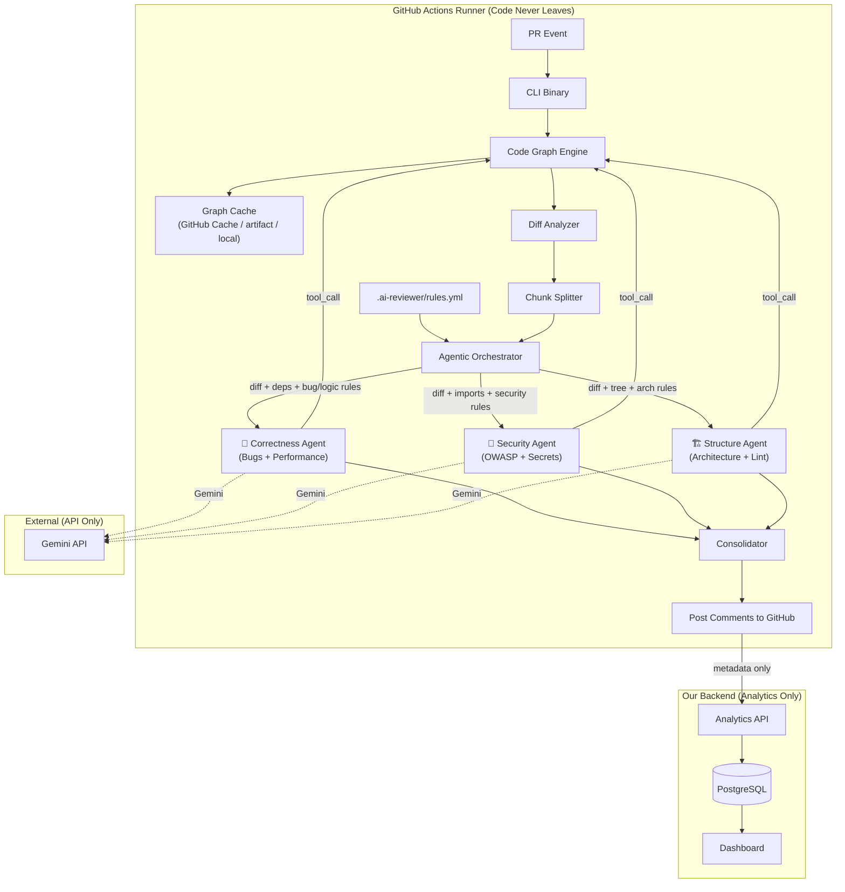
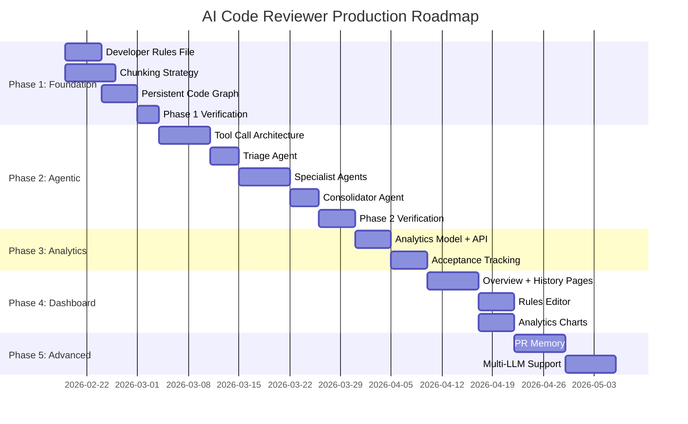

# AI Code Reviewer — Production Plan

> **Document Status**: Living document. Updated: 2026-02-18  
> **Scope**: Complete phased roadmap from current state → production-grade agentic review system.

---

## Current State Audit

Before planning, here is an honest assessment of **what exists today** and **what is missing**.

### What Works

| Component | Status | Notes |
| :--- | :---: | :--- |
| GitHub Action (CLI mode) | ✅ | `action.yml` → builds Go binary → runs locally on runner |
| SaaS Webhook mode | ✅ | `main.go` → GitHub App webhook → `processPR` |
| Tree-sitter Code Graph | ✅ | `codegraph/` package: parser, scanner, symbol resolution |
| Single LLM call (Gemini) | ✅ | `llm.RunReview` → monolithic prompt → JSON response |
| Dashboard (Next.js) | ✅ | Login, API key, layer toggles per repo |
| Context Window Mgmt | ⚠️ | Priority truncation exists but is brute-force (char limit) |

### What Is Missing / Broken

| Gap | Impact |
| :--- | :--- |
| **Single monolithic LLM call** | All review logic crammed into one prompt. No specialization, high noise. |
| **No agentic loop / tool calls** | LLM cannot request additional context. "One shot, hope for the best." |
| **No chunking** | Large PRs hit token limits. Truncation = lost context = missed bugs. |
| **No developer rules file** | Teams cannot customize what to skip/focus on. |
| **Code graph rebuilt every run** | 100% parse cost on every PR event. No persistence, no delta updates. |
| **No analytics** | Zero visibility into review adoption, acceptance, or quality. |
| **No review acceptance tracking** | No thumbs up/down, no way to measure helpfulness. |
| **Dashboard is MVP** | Only toggles. No review history, no analytics, no rules editor. |

---

## Hard Constraints

These constraints are non-negotiable and every design decision must respect them:

1. **No code leaves the GitHub Actions runner** — source code must stay on the runner. Only LLM API calls (to Gemini) carry code snippets for inference.
2. **No external servers process code** — our backend/DB receives **only analytics metadata** (counts, severities, file paths). Never source code.
3. **Code graph artifacts can be stored in the repo itself** (committed to a branch or a known path like `.ai-reviewer/`).
4. **LLM provider is Gemini** (2.5 Flash, 1M token context window).
5. **Dashboard backend** is our Go server (for SaaS mode features, analytics ingestion, and settings).

---

## Architecture Overview (Target State)



---

## Phase 1: Foundation Hardening (Week 1–2)

**Goal**: Fix the immediate pain points without changing architecture. Get the basics right before going agentic.

### 1.1 Persistent Code Graph

> **Problem**: Code graph is rebuilt from scratch every single PR run. For a 500-file repo, this is ~3-5 seconds of tree-sitter parsing wasted every time.

**Solution**: Persist the code graph with a **tiered storage strategy** that handles all real-world GitHub edge cases.

#### Where Does the Graph Live? (Tiered Strategy)

Storing the graph is NOT as simple as "commit to repo". Here are all the failure modes and how we handle them:

| Scenario | Problem | What Breaks |
| :--- | :--- | :--- |
| Branch protections | Can't push to `main` or any protected branch | Commit fails |
| User doesn't allow push | Action only has `contents: read` | Commit fails |
| Fork PRs | Forks don't have write access to upstream | Commit fails |
| Concurrent PRs | Two PRs try to update the same graph.json | Merge conflicts |
| Monorepos (2000+ files) | Graph is large, parse is slow | Timeout / OOM |

**Solution: Three-tier fallback with zero write requirements.**

```
Tier 1: GitHub Actions Cache (PRIMARY — no repo writes needed)
  ↓ miss
Tier 2: Build fresh + cache for next run
  ↓ (monorepo optimization)
Tier 3: Incremental / scoped build
```

#### Tier 1: GitHub Actions Cache (Recommended)

Use `actions/cache` to store the graph artifact between workflow runs. **No repo commits, no branch protections, no fork issues.**

```yaml
# In the user's workflow YAML (we document this)
- name: Cache Code Graph
  uses: actions/cache@v4
  with:
    path: .ai-reviewer/graph.json
    key: ai-reviewer-graph-${{ github.repository }}-${{ hashFiles('**/*.go', '**/*.ts', '**/*.py', '**/*.js') }}
    restore-keys: |
      ai-reviewer-graph-${{ github.repository }}-
```

**Why this works for every edge case:**

| Edge Case | How Cache Handles It |
| :--- | :--- |
| Branch protections | Cache is outside the repo. No commits needed. |
| Read-only permissions | Cache API uses `GITHUB_TOKEN` which always has cache access. |
| Fork PRs | Forks can **read** parent repo's cache (GitHub's built-in behavior). They build their own cache on miss. |
| Concurrent PRs | Each cache key is content-hashed. No merge conflicts. If two PRs change different files, they get different cache keys. |
| Monorepos | See Tier 3 below. |

#### Tier 2: Fresh Build (Cache Miss)

On first run or cache miss:
1. Parse all files with tree-sitter → build full graph.
2. Serialize to `.ai-reviewer/graph.json` in the workspace.
3. `actions/cache` automatically saves it for subsequent runs.

#### Tier 3: Monorepo Optimization (2000+ Files)

For massive repos where a full parse is too slow:

1. **Scope the graph**: Only parse files in the **changed directories** + their import targets. Don't index the entire repo.
2. **Parallel parsing**: Split files across goroutines (tree-sitter is already thread-safe per parser instance).
3. **Per-package caching**: Instead of one `graph.json`, use `graph-<package-hash>.json` per top-level directory. Only rebuild the affected package's graph.

```
.ai-reviewer/
├── graph-backend-internal-llm-abc123.json
├── graph-backend-internal-codegraph-def456.json
├── graph-dashboard-src-789abc.json
└── graph.meta.json   # Maps package → hash → file list
```

**Budget**: For a 2000-file monorepo where a PR touches `backend/internal/llm/`:
- **Without optimization**: Parse 2000 files → ~15s
- **With scoped graph**: Parse ~50 files (changed package + 1 level of imports) → ~0.5s

#### Graph Format

```json
{
  "version": 1,
  "indexed_at": "2026-02-18T12:00:00Z",
  "commit_sha": "abc123",
  "files": {
    "internal/llm/llm.go": {
      "hash": "sha256:...",
      "definitions": ["RunReview", "buildPrompt", "truncateUTF8"],
      "references": ["models.ReviewResult", "models.PRContext"],
      "imports": ["internal/models"]
    }
  },
  "edges": [
    { "from": "internal/llm/llm.go", "symbol": "ReviewResult", "to": "internal/models/models.go", "kind": "type_usage" }
  ]
}
```

#### Delta Update Logic

```go
func (s *Service) DeltaUpdate(cachedGraph *Graph, changedFiles []string) *Graph {
    for _, file := range changedFiles {
        // 1. Remove old entries for this file
        cachedGraph.RemoveFile(file)
        // 2. Re-parse this file
        newDefs, newRefs := s.Parser.ParseFile(file)
        // 3. Add updated entries
        cachedGraph.AddFile(file, newDefs, newRefs)
    }
    // 4. Rebuild edges from updated definitions + references
    cachedGraph.RebuildEdges()
    return cachedGraph
}
```

#### Changes Required

| File | Change |
| :--- | :--- |
| `internal/codegraph/graph_store.go` | **[NEW]** `Serialize()`, `Deserialize()`, `DeltaUpdate()` |
| `internal/codegraph/codegraph.go` | Add `Graph` struct with serializable fields. Refactor `GetContext()` to accept cached graph |
| `cmd/cli/main.go` | Load graph from `.ai-reviewer/graph.json` → delta update → save after review |
| `action.yml` | Document `actions/cache` step for users (no code change, just docs) |
| `docs/DEVELOPER_GUIDE.md` | Update setup instructions to include cache step |

### 1.2 Developer Rules File

> **Problem**: Teams can't tell the reviewer what to skip or focus on. Every repo gets the same generic review.

**Solution**: A `.ai-reviewer/rules.yml` file in the repo root.

```yaml
# .ai-reviewer/rules.yml
version: 1

# Files/patterns to completely skip
skip:
  - "**/*_test.go"           # Skip test files
  - "**/*.generated.go"     # Skip generated code
  - "vendor/**"             # Skip vendored deps
  - "migrations/**"         # Skip SQL migrations

# Custom focus areas (injected into system prompt)
focus:
  - "All database operations MUST use context (ctx) parameter"
  - "Never use fmt.Println in production code — use structured logger"
  - "All HTTP handlers must validate input before processing"
  - "Ensure all errors are wrapped with context using fmt.Errorf"

# Severity overrides
severity_overrides:
  - pattern: "TODO|FIXME|HACK"
    action: "ignore"  # Don't flag TODOs as issues
  - pattern: "fmt.Println"
    severity: "warning"  # Escalate from info to warning

# Max comments per PR (noise control)
max_comments: 15
```

#### Changes Required

| File | Change |
| :--- | :--- |
| `internal/models/models.go` | Add `ReviewRules` struct |
| `internal/rules/rules.go` | **[NEW]** Parser for `.ai-reviewer/rules.yml` |
| `internal/llm/llm.go` | Inject `focus` rules into system prompt under a new "TEAM RULES" section |
| `internal/llm/llm.go` | Apply `skip` patterns in `filterReviewableFiles()` |
| `cmd/cli/main.go` | Load rules file before review |

### 1.3 Effective Context Window Chunking

> **Problem**: Current approach: shove everything into one prompt, truncate if too big. This loses critical context and produces low-quality reviews for large PRs.

**Solution**: Tree-sitter-aware chunking with per-chunk review + consolidation.

#### Strategy

```
For each PR:
  1. Group changed files into "Review Units" (max ~180K tokens each)
  2. Each unit = related files (same package/directory)
  3. Each unit gets its own LLM call with:
     - The chunk's changed files + their diff
     - The code graph context relevant to THOSE files only
     - The developer rules
     - A shared "PR Summary" (title + description + commit messages)
  4. All per-chunk results are collected
  5. A single "Consolidation" pass merges, deduplicates, and filters
```

#### Changes Required

| File | Change |
| :--- | :--- |
| `internal/chunker/chunker.go` | **[NEW]** Groups files into review units by directory/package proximity and token budget |
| `internal/llm/llm.go` | Extract `buildPrompt` to accept a chunk instead of all files. Add `RunChunkReview()` |
| `internal/orchestrator/orchestrator.go` | **[NEW]** Coordinates chunk reviews → consolidation |

---

## Phase 2: Agentic Review Loop (Week 3–5)

**Goal**: Transform from "single-shot LLM call" to an agentic system where the LLM can request additional context via tool calls.

### 2.1 Tool Call Architecture

> **Key Idea**: Instead of pre-loading all possible context, give the LLM access to tools it can call to fetch what it needs. This keeps the initial prompt small and allows the LLM to be surgical.

#### Available Tools

| Tool | Description | Source |
| :--- | :--- | :--- |
| `get_file_content(path)` | Returns the full content of a file from the repo | Local filesystem on runner |
| `get_symbol_definition(symbol)` | Returns the definition snippet of a symbol (function, type, class) | Code graph index |
| `get_callers(symbol)` | Returns all locations that call a given function/method | Code graph index |
| `get_type_definition(type_name)` | Returns struct/interface/class definition | Code graph index |
| `search_codebase(query)` | Grep-like search across the repo | `git grep` |

#### How It Works with Gemini

Gemini 2.5 Flash supports **function calling** natively:

```json
{
  "tools": [{
    "function_declarations": [
      {
        "name": "get_symbol_definition",
        "description": "Get the source code definition of a symbol (function, type, struct, class, interface). Use this when you see a symbol in the diff that you need to understand.",
        "parameters": {
          "type": "object",
          "properties": {
            "symbol": { "type": "string", "description": "The symbol name to look up" },
            "file_hint": { "type": "string", "description": "Optional: file where the symbol might be defined" }
          },
          "required": ["symbol"]
        }
      }
    ]
  }]
}
```

#### Agentic Loop Flow

```
1. Send initial prompt (diff + code graph summary + rules) to Gemini
2. Gemini responds with either:
   a. A final JSON review result → Done
   b. A tool_call request → Execute the tool locally → send result back → goto 2
3. Max iterations: 5 (safety limit to prevent infinite loops)
4. Each tool call response is appended to the conversation context
```

#### Changes Required

| File | Change |
| :--- | :--- |
| `internal/llm/tools.go` | **[NEW]** Tool definitions and executor. Maps Gemini function calls to local code graph queries |
| `internal/llm/agent.go` | **[NEW]** Agentic loop: send prompt → handle tool calls → collect final result |
| `internal/llm/llm.go` | Refactor `RunReview` to use the agentic loop instead of single-shot |
| `internal/codegraph/codegraph.go` | Expose `GetSymbolDefinition()`, `GetCallers()`, `GetTypeDefinition()` as public API for tools |

### 2.2 Parallel Specialist Agents (Different Prompts, Different Context)

> **Problem**: One monolithic prompt trying to be a security expert, bug hunter, and architect simultaneously produces mediocre results across all five review layers.

**Solution**: Divide the 5 review layers into **3 specialist agents** that run **in parallel**, each with:
- A **different system prompt** tuned to its domain
- **Different context** from the code graph (each agent sees what matters to it)
- **Different rules** extracted from the developer's rules file
- **Independent tool call** capabilities

#### How We Divide the 5 Layers into 3 Agents

| Agent | Layers Covered | Rationale |
| :--- | :--- | :--- |
| 🐛 **Correctness Agent** | **Bugs** + **Performance** | Both require deep understanding of runtime behavior, data flow, and state. A bug is a wrong operation; a performance issue is an expensive operation. Same analytical muscle. |
| 🔐 **Security Agent** | **Security** (standalone) | Security is a fundamentally different mindset — adversarial thinking, threat modeling, trust boundaries. Mixing it with logic review dilutes both. Deserves its own focused lens. |
| 🏗️ **Structure Agent** | **Architecture** + **Lint** | Both are about code **shape** and **convention** adherence — not runtime behavior. Does the code follow project patterns? Is it in the right package? Are naming conventions followed? Same structural thinking. |

#### Agent Pipeline (All 3 Run in Parallel)

```
┌─────────────────────────────────────────────────────────────────┐
│              Orchestrator (Prepares Context Per Agent)           │
│                                                                 │
│  Reads: diff, code graph, rules.yml, PR metadata               │
│  Splits context per agent (see table below)                     │
└─────┬───────────────────┬───────────────────┬───────────────────┘
      │                   │                   │
      ▼                   ▼                   ▼
┌───────────┐     ┌───────────┐       ┌───────────┐
│ 🐛 CORRECT│     │ 🔐 SECUR  │       │ 🏗️ STRUCT │
│           │     │           │       │           │
│ Bugs +    │     │ Security  │       │ Arch +    │
│ Perf      │     │  Only     │       │ Lint      │
│           │     │           │       │           │
│ tool_call │     │ tool_call │       │ tool_call │
│   ↕       │     │   ↕       │       │   ↕       │
│ Code Graph│     │ Code Graph│       │ Code Graph│
└─────┬─────┘     └─────┬─────┘       └─────┬─────┘
      │                 │                   │
      └────────┬────────┘───────────────────┘
               ▼
      ┌─────────────────┐
      │  CONSOLIDATOR   │  Merges, deduplicates, resolves conflicts,
      │                 │  enforces max_comments from rules.yml
      └─────────────────┘
```

> [!IMPORTANT]
> **All 3 agents run in parallel** (Go goroutines). No triage pass needed — because each agent already gets only relevant context and has a focused prompt. The orchestrator does the routing, not another LLM call.

#### Per-Agent Context & Prompt Strategy

This is the core of the design — **each agent sees different things**:

##### 🐛 Correctness Agent (Bugs + Performance)

| What It Receives | Why |
| :--- | :--- |
| **Diff hunks** with full function bodies containing changes | Needs to see surrounding logic to find bugs |
| **Code graph: data flow edges** | "Variable X is set in file A, used in file B" — catches data corruption |
| **Code graph: function call chains** | "func A calls func B which calls func C" — catches nil propagation |
| **Code graph: type definitions** of all types used in the diff | Verifies type safety, catches wrong field access |
| **Rules: `focus` entries related to logic** | e.g., "All DB calls must use ctx parameter" |

**System Prompt Focus**:
```
You are a CORRECTNESS ANALYZER. Your ONLY job is finding:
1. Logic errors (wrong conditions, missing edge cases, off-by-one)
2. Nil/null pointer dereferences
3. Error handling gaps (unchecked errors, swallowed errors, wrong error propagation)
4. Race conditions on shared state
5. Resource leaks (unclosed files, connections, channels)
6. Performance issues (O(n²) in hot paths, unnecessary allocations, missing caching)
7. Data corruption (wrong type assertions, truncated data, overflow)

You have tool access to look up symbol definitions and call sites.
If you see a function call you don't understand, USE the get_symbol_definition tool.
If you're unsure about a type's fields, USE the get_type_definition tool.

DO NOT look for: security issues, style issues, naming conventions, architecture concerns.
Those are handled by other specialized reviewers.
```

##### 🔐 Security Agent (Security Only)

| What It Receives | Why |
| :--- | :--- |
| **Diff hunks** (same as correctness) | Needs to see what changed |
| **Code graph: import graph** | "This file imports crypto/md5" — catches weak crypto |
| **Code graph: function signatures** of auth/validation functions used in diff | Verifies auth is actually called, not bypassed |
| **Full content of files in `auth/`, `middleware/`, `security/`** touched by the diff | Sensitive code needs full visibility |
| **Rules: `focus` entries related to security** | e.g., "Never log PII fields" |

**System Prompt Focus**:
```
You are a SECURITY AUDITOR performing adversarial analysis. Your ONLY job is finding:
1. Injection vulnerabilities (SQL, command, XSS, LDAP, template)
2. Authentication/authorization bypasses
3. Secret/credential exposure (hardcoded keys, logged passwords, PII in errors)
4. Unsafe deserialization
5. Missing input validation on trust boundaries
6. Insecure cryptographic usage (weak hashing, broken random)
7. SSRF, path traversal, open redirects
8. Missing CSRF/CORS protections

Think like an ATTACKER. For each changed line, ask: "How can this be exploited?"
If a function handles user input, USE get_symbol_definition to trace where that input goes.
If you see an auth check, USE get_callers to verify it's not bypassed elsewhere.

DO NOT look for: business logic bugs, performance issues, code style, architecture.
Those are handled by other specialized reviewers.
```

##### 🏗️ Structure Agent (Architecture + Lint)

| What It Receives | Why |
| :--- | :--- |
| **Diff hunks** (summary-level, not full function bodies) | Needs less detail — cares about shape, not logic |
| **Full repo tree structure** | Architecture analysis needs to know where things live |
| **Code graph: dependency direction graph** | "Package A imports Package B" — catches circular deps, wrong layer access |
| **Code graph: interface definitions** | Verifies new code implements required interfaces correctly |
| **Rules: `focus` entries related to architecture/lint** | e.g., "Controllers must not import database package directly" |

**System Prompt Focus**:
```
You are a STRUCTURAL REVIEWER focused on code organization and conventions. Your ONLY job:
1. Architecture violations (wrong package dependencies, circular imports)
2. Pattern consistency (does new code follow existing patterns in the codebase?)
3. Interface compliance (does the implementation satisfy the interface contract?)
4. Naming conventions (exported vs unexported, consistent naming schemes)
5. Code organization (is this file in the right package? right layer?)
6. Dead code, orphaned files, missing test files for new packages
7. API design issues (breaking changes to exported functions/types)

You have access to the full repository tree structure.
USE get_file_content to check how similar code is organized elsewhere.
USE get_callers to check if a renamed/removed function breaks dependents.

DO NOT look for: runtime bugs, security vulnerabilities, performance issues.
Those are handled by other specialized reviewers.
```

#### What the Consolidator Does

The consolidator is an LLM call that receives the merged output of all 3 agents and performs:

1. **Deduplication**: If Correctness and Security both flag the same line → keep the higher severity
2. **Conflict Resolution**: If one agent says "this is fine" and another flags it → keep the flag but lower severity
3. **Priority Ranking**: Sort by severity (critical → warning → info), then by file order in the diff
4. **Cap Enforcement**: Apply `max_comments` from `rules.yml` (default: 15)
5. **Format**: Output final JSON matching `ReviewResult` schema

**Consolidator System Prompt**:
```
You are a REVIEW CONSOLIDATOR. You receive findings from 3 specialist reviewers.
Your job:
1. Remove duplicates (same file + same line + same issue = keep one)
2. If two agents flag different issues on the same line, keep BOTH
3. Remove comments that are vague or lack a specific fix
4. Cap total comments at {max_comments}
5. Ensure every comment has correct file path and line number from the diff
6. Output valid JSON matching the schema exactly
```

#### Cost Impact of 3 Parallel Agents

Because agents run **in parallel** and each gets **less context** (only relevant parts), the total tokens are not 3x:

| Component | Tokens (Single call) | Tokens (3 Agents) | Notes |
| :--- | :--- | :--- | :--- |
| System prompt | 3K | 3K × 3 = 9K | Each agent has focused prompt (~3K) |
| Diff content | 30K | 30K × 3 = 90K | Each agent sees the same diff (unavoidable) |
| Code graph context | 20K (everything) | ~8K × 3 = 24K | Each agent gets ONLY relevant edges |
| Rules | 1K | ~0.3K × 3 = 0.9K | Each agent gets own section of rules |
| Tool call results | 0 | ~5K per agent = 15K | Only when agents need more context |
| **Total Input** | **~54K** | **~139K** | ~2.6x |
| Consolidator | 0 | ~10K (input: all outputs) | Cheap: just merging short findings |
| **Total with Consolidator** | **~54K** | **~149K** | ~2.8x input for much higher quality |

#### Changes Required

| File | Change |
| :--- | :--- |
| `internal/agents/types.go` | **[NEW]** Shared types: `AgentConfig`, `AgentResult`, `ConsolidatedResult` |
| `internal/agents/correctness.go` | **[NEW]** Bugs + Performance review agent with data-flow context |
| `internal/agents/security.go` | **[NEW]** Security-only review agent with import graph context |
| `internal/agents/structure.go` | **[NEW]** Architecture + Lint review agent with repo tree context |
| `internal/agents/consolidator.go` | **[NEW]** Merges, deduplicates, filters all agent results |
| `internal/agents/prompts.go` | **[NEW]** All 3 specialist system prompts + consolidator prompt |
| `internal/orchestrator/orchestrator.go` | Prepare per-agent context → fan-out → collect → consolidate |

---

## Phase 3: Analytics & Feedback (Week 6–7)

**Goal**: Measure adoption and quality. Know if reviews are actually helping developers.

### 3.1 Analytics Data Model

> **Constraint Reminder**: Only metadata goes to our server. Never source code.

#### What We Collect (Metadata Only)

```go
type ReviewEvent struct {
    // Identification
    RepoID       string    `json:"repo_id"`
    PRNumber     int       `json:"pr_number"`
    Timestamp    time.Time `json:"timestamp"`
    
    // Review Stats
    CommentsPosted   int `json:"comments_posted"`
    CriticalCount    int `json:"critical_count"`
    WarningCount     int `json:"warning_count"`
    InfoCount        int `json:"info_count"`
    
    // Context Stats
    FilesChanged     int `json:"files_changed"`
    LinesChanged     int `json:"lines_changed"`
    DepsResolved     int `json:"deps_resolved"`
    ToolCallsMade    int `json:"tool_calls_made"`
    ChunksProcessed  int `json:"chunks_processed"`
    
    // Cost
    InputTokens      int     `json:"input_tokens"`
    OutputTokens     int     `json:"output_tokens"`
    TotalCostUSD     float64 `json:"total_cost_usd"`
    
    // Timing
    TotalDurationMs  int64 `json:"total_duration_ms"`
    GraphLoadMs      int64 `json:"graph_load_ms"`
    LLMCallMs        int64 `json:"llm_call_ms"`
    
    // Quality (populated later via webhook)
    CommentsAccepted int `json:"comments_accepted"` // Thumbs up / resolved
    CommentsRejected int `json:"comments_rejected"` // Thumbs down / dismissed
}
```

#### How Acceptance Tracking Works

1. Each review comment posted to GitHub includes two reaction options:
   - 👍 = "This was helpful" (developer implements the fix)
   - 👎 = "False positive" (developer dismisses)
2. We track this via **GitHub webhook events** (`pull_request_review_comment` reactions) on our backend server.
3. The CLI mode (action) reports the review event metadata to our analytics API after posting comments.

#### Analytics API Endpoint

```
POST /api/analytics/review-event
Authorization: Bearer <repo-specific-token>
Content-Type: application/json

{
  "repo_id": "12345",
  "pr_number": 42,
  ...
}
```

> [!CAUTION]
> The analytics payload must **never** contain file contents, diff text, or comment messages. Only counts and paths.

### 3.2 Changes Required

| File | Change |
| :--- | :--- |
| `internal/models/analytics.go` | **[NEW]** `ReviewEvent` struct |
| `internal/analytics/reporter.go` | **[NEW]** Sends metadata to our backend after review |
| `backend/main.go` | Add `POST /api/analytics/review-event` handler |
| `internal/database/migrations/` | **[NEW]** `review_events` table schema |
| `cmd/cli/main.go` | Call analytics reporter after posting comments |

---

## Phase 4: Dashboard Evolution (Week 8–10)

**Goal**: Transform the MVP dashboard into a useful admin panel.

### 4.1 Feature Roadmap (Given Constraints)

Since we can only store analytics metadata, the dashboard shows:

| Feature | Data Source | Priority |
| :--- | :--- | :--- |
| **Review History** | `review_events` table | P0 |
| **Acceptance Rate** | `comments_accepted / comments_posted` ratio | P0 |
| **Cost Tracker** | `total_cost_usd` per repo/month | P1 |
| **Common Issue Types** | Aggregate `severity` + `layer` counts | P1 |
| **Rules Editor** | Generates `.ai-reviewer/rules.yml` to commit to repo | P2 |
| **Per-Repo Trends** | Time series of review quality metrics | P2 |

### 4.2 Dashboard Pages

```
/dashboard
├── /overview          # Total reviews, acceptance rate, cost this month
├── /repos             # List repos, per-repo stats, settings
├── /repos/:id/history # Review history for a specific repo
├── /repos/:id/rules   # Rules editor (generates YAML to commit)
└── /analytics         # Global trends, charts, top issues
```

### 4.3 Rules Editor (Dashboard → Repo Commit)

Since code can't come to our server, the rules editor works by:
1. User edits rules in the dashboard UI.
2. Dashboard generates the YAML content.
3. User clicks "Apply" → dashboard uses GitHub API to create a commit with the `.ai-reviewer/rules.yml` file in the repo.
4. Next PR run picks up the new rules.

#### Changes Required

| File | Change |
| :--- | :--- |
| `dashboard/src/app/overview/page.tsx` | **[NEW]** Overview page with charts |
| `dashboard/src/app/repos/[id]/history/page.tsx` | **[NEW]** Review history table |
| `dashboard/src/app/repos/[id]/rules/page.tsx` | **[NEW]** Rules YAML editor |
| `dashboard/src/app/analytics/page.tsx` | **[NEW]** Global analytics charts |
| Backend API | Add `GET /api/analytics/repos/:id/events`, `GET /api/analytics/summary` |

---

## Phase 5: Advanced Intelligence (Week 11+)

**Goal**: Long-term improvements for enterprise-grade quality.

### 5.1 PR Memory (Cross-Commit Context)

Track issues across multiple commits within the same PR:
- If the LLM flagged a bug on commit A, and commit B doesn't fix it → re-flag.
- If commit B introduces a new bug → flag only the new one.
- Avoids duplicate comments across `synchronize` events.

**Implementation**: Store a per-PR review state file in a temporary branch or use GitHub PR metadata (comments already posted).

### 5.2 Semantic Caching

Hash the code graph + diff to detect "nothing meaningful changed":
- If a PR commit only changes whitespace or comments → skip re-review.
- If a file was already reviewed in this PR and hasn't changed → skip.

### 5.3 Multi-LLM Provider Support

Decouple the `internal/llm` package to support:
- Gemini (default)
- OpenAI GPT-4o
- Anthropic Claude
- Self-hosted models (Llama, Mistral) for air-gapped environments

### 5.4 IDE Pre-Flight (VS Code Extension)

Run a lightweight version of the review locally before pushing:
- Uses the same code graph and rules.
- Runs only the triage + logic review agents.
- Shows inline warnings in the editor.

---

## Implementation Priority Matrix

| Phase | Feature | Effort | Impact on Accuracy | Priority |
| :---: | :--- | :---: | :---: | :---: |
| 1 | Persistent Code Graph | Medium | Low (perf only) | P1 |
| 1 | Developer Rules File | Low | **High** | **P0** |
| 1 | Chunking Strategy | Medium | **High** | **P0** |
| 2 | Tool Call Architecture | High | **Critical** | **P0** |
| 2 | Multi-Purpose Agents | High | **Critical** | **P0** |
| 3 | Analytics Reporter | Medium | Medium | P1 |
| 3 | Acceptance Tracking | Medium | Medium | P1 |
| 4 | Dashboard Overview | Medium | Low | P2 |
| 4 | Dashboard Rules Editor | Medium | Medium | P2 |
| 5 | PR Memory | High | Medium | P3 |
| 5 | Multi-LLM Support | Medium | Low | P3 |

---

## Cost Projection (With Agentic Architecture)

Moving from 1 LLM call to 3 parallel specialist agents + consolidator increases token usage but each agent gets **focused context** (not the full dump), keeping costs reasonable:

| Scenario | Current (1 call) | Phase 2 (3 Agents + Consolidator) | Notes |
| :--- | :--- | :--- | :--- |
| Small PR (3 files) | ~15K tokens, ₹0.16 | ~50K tokens, ₹0.50 | All 3 agents + consolidator (cheap PR, all agents are fast) |
| Medium PR (15 files) | ~80K tokens, ₹0.76 | ~150K tokens, ₹1.44 | Each agent gets ~40K focused context + tool calls |
| Large PR (50 files) | ~400K tokens, ₹3.71 | ~600K tokens, ₹5.58 | Chunked into units, each chunk reviewed by all 3 agents |
| **Monthly (1000 PRs)** | **₹695** | **₹1,400** | ~2x cost for ~3x accuracy improvement |

> [!NOTE]
> The cost roughly doubles, not triples, because each agent gets **less context than the current monolithic prompt**. The current system dumps everything into one prompt (~54K for medium PR). Each specialist gets only ~15K of relevant context. The math: 3 × 15K = 45K ≈ current 54K, plus overhead for tool calls and consolidation.

---

## File Structure (Target)

```
backend/
├── cmd/
│   ├── cli/main.go              # GitHub Action entry point
│   └── benchmark/main.go        # Benchmarking tool
├── internal/
│   ├── action/                   # Local git operations for CLI mode
│   ├── agents/                   # [NEW] Parallel specialist agents
│   │   ├── types.go              # Shared: AgentConfig, AgentResult
│   │   ├── correctness.go        # 🐛 Bugs + Performance agent
│   │   ├── security.go           # 🔐 Security-only agent
│   │   ├── structure.go          # 🏗️ Architecture + Lint agent
│   │   ├── consolidator.go       # Result merger and dedup
│   │   └── prompts.go            # All specialist system prompts
│   ├── analytics/                # [NEW] Review event reporting
│   │   └── reporter.go
│   ├── api/                      # REST API handlers
│   ├── auth/                     # OAuth handlers
│   ├── chunker/                  # [NEW] File grouping by token budget
│   │   └── chunker.go
│   ├── codegraph/                # Tree-sitter code graph
│   │   ├── codegraph.go          # Core graph logic
│   │   ├── graph_store.go        # [NEW] Serialize / Deserialize / DeltaUpdate
│   │   ├── parser.go             # AST parsing
│   │   ├── scanner.go            # Symbol search
│   │   └── languages.go          # Language configs
│   ├── database/                 # DB connection + migrations
│   ├── github/                   # GitHub API wrapper
│   ├── llm/                      # LLM client (refactored)
│   │   ├── llm.go                # Core Gemini client + function calling
│   │   ├── agent.go              # [NEW] Agentic loop: prompt → tool calls → result
│   │   └── tools.go              # [NEW] Tool definitions for code graph queries
│   ├── models/                   # Shared domain models
│   │   ├── models.go
│   │   └── analytics.go          # [NEW] Review event struct
│   ├── orchestrator/             # [NEW] Pipeline coordinator
│   │   └── orchestrator.go       # Context prep → fan-out → collect → consolidate
│   └── rules/                    # [NEW] Developer rules parser
│       └── rules.go
└── main.go                       # SaaS webhook server
```

---

## Verification Strategy

### Per-Phase Verification

| Phase | Verification Method |
| :--- | :--- |
| Phase 1 | Run existing benchmark suite. Compare with/without chunking. Verify rules file is parsed and injected. |
| Phase 2 | Run benchmark suite with agents. Measure recall improvement vs single-shot. Verify tool calls execute correctly. |
| Phase 3 | Post a PR, verify analytics event arrives at backend. Check dashboard displays data. |
| Phase 4 | Manual testing of dashboard UI. Verify rules editor generates valid YAML. |
| Phase 5 | Cross-commit PR test. Verify no duplicate comments. |

### Success Metrics

| Metric | Current Baseline | Phase 1 Target | Phase 2 Target |
| :--- | :--- | :--- | :--- |
| **Recall** (bugs found) | ~60% | ~70% | **~85%+** |
| **Precision** (signal/noise) | ~40% | ~55% | **~75%+** |
| **False Positive Rate** | High | Medium | **Low** |
| **Review Latency** (median) | ~25s | ~20s | ~35s (more calls, but better) |
| **Cost per PR** (median) | ₹0.76 | ₹0.80 | ₹1.24 |

---

## Execution Order Summary



---

## Key Design Decisions & Rationale

### Why Agentic Tool Calls Instead of Pre-Loading Context?

| Approach | Pros | Cons |
| :--- | :--- | :--- |
| Pre-load all deps (current) | Simple. One LLM call. | Wastes tokens on irrelevant deps. Hits context limits on large repos. |
| **Tool calls (proposed)** | LLM fetches only what it needs. Surgical context. | More LLM round-trips. Slightly higher latency. |

**Decision**: Tool calls. The LLM already has the code graph summary showing all relationships. It knows what's connected. Let it decide what to fetch in full. This keeps the initial prompt focused and avoids the "needle in a haystack" problem of dumping 500K tokens of deps.

### Why Not RAG / Vector Store for Project Memory?

| Approach | Pros | Cons |
| :--- | :--- | :--- |
| RAG with embeddings | Semantically searches docs, ADRs | Requires embedding model. Extra infra. Non-deterministic retrieval. |
| **Rules file (proposed)** | Deterministic. Version-controlled. Developer writes the rules. | No semantic search. Manual maintenance. |

**Decision**: Start with the rules file (Phase 1). It's deterministic, version-controlled, and developers own it. RAG can be added in Phase 5 if teams need more sophisticated project memory.

### Why Run All 3 Agents in Parallel (No Triage)?

Earlier versions of this plan included a "Triage Agent" that classifies files first. We removed it because:

1. **The orchestrator already knows** which files to route — it has the code graph, the diff, and the rules file. Routing is deterministic, not an LLM task.
2. **Triage adds latency** — even a cheap LLM call is 2-3s. Running it first means specialists can't start until it finishes.
3. **Over-filtering is dangerous** — if triage incorrectly says "no security surface", the security agent never runs. Better to always run all 3 and let the consolidator filter noise.

**Current design**:
```
Parallel: [Correctness, Security, Structure] → Sequential: Consolidator
```

All 3 agents launch simultaneously. Total LLM time ≈ slowest agent time (not sum), since they run in parallel goroutines. The consolidator runs after all 3 complete.
