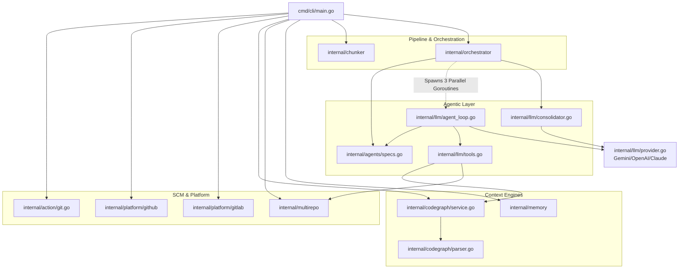

# AI Code Reviewer Architecture & Data Flow

This document maps out the internal architecture, component responsibilities, and the lifecycle of data as it flows through the AI Code Reviewer (written in Go).

## 1. High-Level Component Interaction Diagram

This flowchart illustrates the hierarchical call structure (what is calling what) within the system's Go packages.



## 2. Step-by-Step Data Flow

The lifecycle of a review request travels through a strictly typed pipeline. Here is how raw PR data turns into intelligent review comments.

### Step 1: Initialization & Local Git Context (`cmd/cli/main.go`)
1. **Trigger**: A CI/CD runner (GitHub Actions/GitLab CI) executes the compiled binary.
2. **Setup**: The CLI parses arguments and initializes the platform client (`github.go` or `gitlab.go`).
3. **Local Action**: It uses `action.GetDiff()` and `action.GetChangedFiles()` to read the local `.git` repository, yielding a raw `diff` string and a map of changed files/contents.

### Step 2: Proactive Code Graph Generation (`internal/codegraph`)
Instead of dumping raw diffs to the LLM, the system performs "Just-in-Time" context gathering.
1. The raw `diff` and changed files map are passed to `codegraph.Service.GetContext()`.
2. The service uses **Tree-Sitter** to parse the AST of the changed files.
3. It identifies imported symbols, types, and function calls referenced in the diff.
4. Using `git grep`, it finds the exact definitions of those symbols across the repository, parses those files, and extracts *only* the definition snippet.
5. **Output**: A deterministic `dependencies` map containing highly relevant background code.

### Step 3: Chunking (`internal/chunker`)
To avoid blowing past token limits, the PR is chunked.
1. `chunker.GroupFiles()` groups the changed files logically.
2. It uses graph edges (from the CodeGraph) to keep files that depend heavily on each other in the same chunk.
3. **Output**: An array of `Chunk` objects containing file scopes and bounded token counts.

### Step 4: Multi-Agent Parallel Orchestration (`internal/orchestrator`)
The Orchestrator loops through each `Chunk` and fans out execution.
1. It filters out non-reviewable files (docs, configs).
2. It prepares **Differentiated Context** for three specialized agents:
   - **Correctness Agent**: Receives the diff + "slim" dependencies (to find bugs/logic errors).
   - **Security Agent**: Receives the diff + "slim" dependencies (to find vulnerabilities/leaks).
   - **Structure Agent**: Receives the diff + the full repository tree structure (to find architectural drift).
3. **Execution**: It spawns three parallel Goroutines, calling `llm.RunAgentReview()`.

### Step 5: The Agentic Tool Loop (`internal/llm/agent_loop.go`)
This is where the LLM does its reasoning.
1. A dynamic prompt is built combining developer rules, PR context, and the diff with explicit line-number mappings.
2. The agent is invoked. If it needs more context, it returns a **Tool Call** (e.g., `get_symbol_definition`, `get_file_content`, `get_callers`, `search_codebase`).
3. The `ToolExecutor` (`internal/llm/tools.go`) securely executes this against the local repository and CodeGraph, returning the result back to the LLM.
4. This loop repeats up to a maximum iteration limit until the agent returns a finalized JSON array of `ReviewComment` objects.

### Step 6: Semantic Consolidation (`internal/llm/consolidator.go`)
Because agents run blindly in parallel, they often flag overlapping issues.
1. All three sets of results (Correctness, Security, Structure) are combined.
2. They are passed to a **Consolidator Agent** (often running on a faster/cheaper model like `gemini-2.5-flash`).
3. The consolidator deduplicates identical issues, merges related warnings into single unified comments, and filters out false positives.
4. **Output**: A final, capped, high-signal JSON `ReviewResult`.

### Step 7: Memory & Output (`internal/platform`)
1. Before posting, the system fetches `PreviousFindings` (comments already made on this PR).
2. `memory.Deduplicate()` removes findings that have already been communicated.
3. Finally, the platform client translates the `ReviewResult` back into API payloads to post inline diff comments and a general PR summary.

---

## 3. Core Data Flow Sequence Diagram

This sequence diagram details the runtime data exchange across boundaries.

```mermaid
sequenceDiagram
    autonumber
    
    participant GH as GitHub/GitLab
    participant CLI as cmd/cli
    participant Graph as codegraph.Service
    participant Orch as orchestrator
    participant Loop as llm.RunAgentReview
    participant Model as LLM Provider
    participant Consolidator as llm.Consolidation
    
    %% Setup
    GH->>CLI: Action Trigger (PR Event)
    CLI->>CLI: Read Git Diff & Changed Files
    
    %% Context Building
    CLI->>Graph: GetContext(changedFiles, diff)
    Graph->>Graph: Tree-Sitter AST Analysis
    Graph->>Graph: Resolve External Symbols
    Graph-->>CLI: Return Graph Dependencies & Snippets
    
    %% Multi-Chunk review
    CLI->>Orch: Chunk Diff & ReviewChunk()
    
    %% Parallel Specialist Execution
    rect rgb(30, 30, 50)
    Note over Orch, Loop: Fan-Out: Parallel Goroutines (Correctness, Security, Structure)
    Orch->>Loop: RunAgentReview(CorrectnessConfig)
    Orch->>Loop: RunAgentReview(SecurityConfig)
    Orch->>Loop: RunAgentReview(StructureConfig)
    
    loop Agentic Tool Loop (Per Agent)
        Loop->>Model: Analyze Diff + Context
        opt Needs deeper context?
            Model-->>Loop: Function Call: get_callers("db.GetUser")
            Loop->>Graph: Fetch locally cached context
            Graph-->>Loop: Return Function Usages
            Loop->>Model: Return Tool Execution Result
        end
        Model-->>Loop: Return JSON Review Findings
    end
    Loop-->>Orch: Return []ReviewComments
    end
    
    %% Consolidation
    Orch->>Consolidator: Pass ALL findings
    Consolidator->>Model: Deduplicate and Merge Prompt (Flash Model)
    Model-->>Consolidator: Unified Final JSON
    Consolidator-->>CLI: Final ReviewResult Payload
    
    %% Teardown & Post
    CLI->>GH: Post Inline Comments & PR Summary
```

### Notable Architectural Design Patterns

1. **"Dumb" LLM / "Smart" Host**: Rather than expecting the LLM to search a massive codebase, the Go layer pre-calculates dependencies using AST (Tree-Sitter) and hands the LLM highly curated, deterministic graph snapshots.
2. **Context Caching**: For large diffs, `BuildGlobalStaticContext()` pushes the repository tree and slim dependencies to the LLM Provider's Context Caching API. This vastly speeds up subsequent tool-loop iterations and reduces token costs.
3. **Tool Execution Isolation**: Tools (like `get_file_content` or `search_codebase`) are executed purely locally via the `ToolExecutor`. The LLM never has raw shell or network access.
